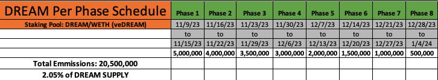

# 🪙 DREAM Token and Tokenomics

<figure><figcaption>
$DREAM Token Allocation
</figcaption></figure>

**Total Supply: 1,000,000,000**

As the team believes deeply in the values of web3, decentralization, and open-source software, the launch of the [$DREAM](https://etherscan.io/token/0xebcf2fbe20e7bbbd5232eb186b85c143d362074e) token has been designed with all of this in mind, and will be conducted using a Fair Launch Auction, as opposed to other types of TGE events as the team believes this is the most sustainable mechanism for bootstrapping liquidity.

### **Allocation**

1 billion DREAM have been minted at genesis and will become accessible in time. If you are familiar with UNI (Uniswap Token), you will notice that DREAM follows a similar schedule, with cliffs and vesting for advisors. The initial allocation is as follows:&#x20;

* 51% to DREAMBYT3 community members _`510,000,000 DREAM`_&#x20;
* 28% to past and future core contributors with 1-month cliff and 1-year vesting _`280,000,000 DREAM`_&#x20;
* 8% to investors with 3-month cliff and 1-year vesting _`80,000,000 DREAM`_&#x20;
* 3% to advisors with 3-month cliff and 1-year vesting _`30,000,000 DREAM`_&#x20;
* 10% to the DREAM LBP event _`100,000,000 DREAM`_&#x20;

Total DREAM Supply: _`1,000,000,000 DREAM`_&#x20;

Core contributors' and launch partners' DREAM allocations will have tokens vested on an identical schedule with the addition of a 1 month cliff for transfers. Advisors' DREAM allocation will vest over 12 months with a 3 month cliff.

## Initial Emissions Program

The DREAMBYT3 protocol’s initial emissions program emits 2.05% of the total DREAM supply to incentivize liquidity provisioning. The program term is approximately two months.

<figure><figcaption>
DREAM Initial Emissions Program
</figcaption></figure>

For further details see the [vedream-and-staking.md](vedream-and-staking.md "mention") mechanism as to how you can obtain veDREAM.

<figure><figcaption></figcaption></figure>
